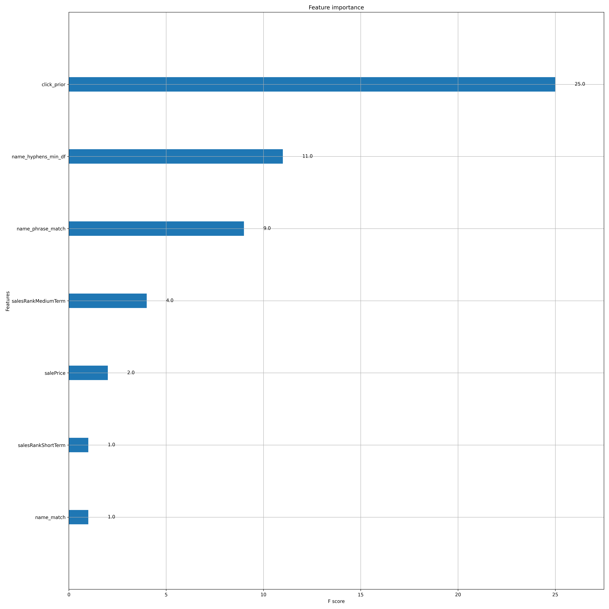

# Week 2 - Project 2

## Level 1: Implementing End to End LTR for our Dataset

### Step 1: Be sure you’ve

1. Setup the project per above (re-indexed content, etc.)
    - Done.
1. Your week2 pyenv is activated: `pyenv activate search_with_ml_week2`
    - Done.

### Step 2: Familiarize yourself with the code and our query logs

- `./week2/utilities`
    - Done.
- `/ltr-end-to-end.sh`
    - Done.

### Step 3: Try out a few commands from the terminal in your Gitpod UI

1. Run `python week2/utilities/build_ltr.py -h`
    - Done.
1. Run `python week2/utilities/build_ltr.py --lookup_query "canon rebel" --all_clicks /workspace/datasets/train.csv | less `
    - Done.
1. Run `python week2/utilities/build_ltr.py --lookup_product 1980124`
    - Done.
1. Familiarize yourself with Pandas
    - Done.
1. Execute `mkdir /workspace/ltr_output` and then `cp data/validity.csv /workspace/ltr_output/` 

```validity.csv``` was produced with `build_ltr –verify_products …`, and identifies skus from the training data which do NOT exist in the index.

1. Run `./ltr-end-to-end.sh -y`

Reviewed code for:
- `python week2/utilities/build_ltr.py --create_ltr_store`
- `python week2/utilities/build_ltr.py -f week2/conf/ltr_featureset.json --upload_featureset`
- `python week2/utilities/build_ltr.py --output_dir /workspace/ltr_output --split_input /workspace/datasets/train.csv --split_train_rows 1000000 --split_test_rows 1000000`
- `python week2/utilities/build_ltr.py --generate_impressions --output_dir /workspace/ltr_output --train_file /workspace/ltr_output/train.csv --synthesize` *** TODO: Review again "rank" and "impressions calculations ***
- `python week2/utilities/build_ltr.py --ltr_terms_field sku --output_dir /workspace/ltr_output --create_xgb_training -f week2/conf/ltr_featureset.json --click_model heuristic`
- `python week2/utilities/build_ltr.py  --output_dir /workspace/ltr_output --xgb /workspace/ltr_output/training.xgb --xgb_conf week2/conf/xgb-conf.json`
- `python week2/utilities/build_ltr.py --upload_ltr_model --xgb_model /workspace/ltr_output/xgb_model.model`
- `python week2/utilities/build_ltr.py --xgb_plot --output_dir /workspace/ltr_output`
- `python week2/utilities/build_ltr.py --xgb_test /workspace/ltr_output/test.csv --train_file /workspace/ltr_output/train.csv --output_dir /workspace/ltr_output --xgb_test_num_queries 200`
- `python week2/utilities/build_ltr.py --analyze --output_dir /workspace/ltr_output`

**Run #1: With provided features**

Simple MRR is 0.362
LTR Simple MRR is 0.355
Hand tuned MRR is 0.428
LTR Hand Tuned MRR is 0.410

Simple p@10 is 0.139
LTR simple p@10 is 0.138
Hand tuned p@10 is 0.203
LTR hand tuned p@10 is 0.188
Simple better: 625      LTR_Simple Better: 483  Equal: 1887
HT better: 1573 LTR_HT Better: 801      Equal: 963

**Run #2: With provided features**

Simple MRR is 0.351
LTR Simple MRR is 0.332
Hand tuned MRR is 0.423
LTR Hand Tuned MRR is 0.403

Simple p@10 is 0.123
LTR simple p@10 is 0.122
Hand tuned p@10 is 0.194
LTR hand tuned p@10 is 0.179
Simple better: 349      LTR_Simple Better: 261  Equal: 1401
HT better: 1131 LTR_HT Better: 475      Equal: 696

**Run #3: After re-implemented click_models.step()**

Simple MRR is 0.352
LTR Simple MRR is 0.348
Hand tuned MRR is 0.435
LTR Hand Tuned MRR is 0.432

Simple p@10 is 0.136
LTR simple p@10 is 0.135
Hand tuned p@10 is 0.192
LTR hand tuned p@10 is 0.184
Simple better: 573      LTR_Simple Better: 495  Equal: 1699
HT better: 1428 LTR_HT Better: 864      Equal: 669

**Run #4: With Down Sampling**

Simple MRR is 0.348
LTR Simple MRR is 0.336
Hand tuned MRR is 0.408
LTR Hand Tuned MRR is 0.402

Simple p@10 is 0.133
LTR simple p@10 is 0.133
Hand tuned p@10 is 0.179
LTR hand tuned p@10 is 0.170
Simple better: 443      LTR_Simple Better: 383  Equal: 1638
HT better: 1202 LTR_HT Better: 791      Equal: 578

## Level 2: Exploring Features and Click Models

**Run #5: With gaussian-decayed (origin=1, scale=100) salesRankShortTerm feature**

Simple MRR is 0.309
LTR Simple MRR is 0.315
Hand tuned MRR is 0.398
LTR Hand Tuned MRR is 0.410

Simple p@10 is 0.099
LTR simple p@10 is 0.099
Hand tuned p@10 is 0.170
LTR hand tuned p@10 is 0.172
Simple better: 373      LTR_Simple Better: 410  Equal: 1424
HT better: 1039 LTR_HT Better: 750      Equal: 761

**Run #6: With gauss-decayed salesRankShortTerm and salesRankMediumTerm features**

Simple MRR is 0.310
LTR Simple MRR is 0.307
Hand tuned MRR is 0.447
LTR Hand Tuned MRR is 0.458

Simple p@10 is 0.116
LTR simple p@10 is 0.114
Hand tuned p@10 is 0.188
LTR hand tuned p@10 is 0.184
Simple better: 578      LTR_Simple Better: 564  Equal: 1431
HT better: 1253 LTR_HT Better: 869      Equal: 660

**Run #7: With gauss-decayed salesRankShortTerm, salesRankMediumTerm, and salesRankLongTerm features**

Simple MRR is 0.364
LTR Simple MRR is 0.364
Hand tuned MRR is 0.417
LTR Hand Tuned MRR is 0.426

Simple p@10 is 0.133
LTR simple p@10 is 0.131
Hand tuned p@10 is 0.164
LTR hand tuned p@10 is 0.167
Simple better: 623      LTR_Simple Better: 631  Equal: 1366
HT better: 1280 LTR_HT Better: 936      Equal: 571

**Run #8: With "as is" (Not Gaussian-decayed) salesRankShortTerm, salesRankMedium Term, and salesRankLongTerm**

Simple MRR is 0.367
LTR Simple MRR is 0.363
Hand tuned MRR is 0.501
LTR Hand Tuned MRR is 0.482

Simple p@10 is 0.140
LTR simple p@10 is 0.143
Hand tuned p@10 is 0.214
LTR hand tuned p@10 is 0.217
Simple better: 501      LTR_Simple Better: 537  Equal: 1575
HT better: 1232 LTR_HT Better: 862      Equal: 751

**Run #9: With "as is" (Not Gaussian-decayed) salesRankShortTerm, salesRankMedium Term, and salesRankLongTerm; Without name_hyphens_min_df**

Simple MRR is 0.337
LTR Simple MRR is 0.328
Hand tuned MRR is 0.447
LTR Hand Tuned MRR is 0.447

Simple p@10 is 0.128
LTR simple p@10 is 0.128
Hand tuned p@10 is 0.191
LTR hand tuned p@10 is 0.185
Simple better: 601      LTR_Simple Better: 583  Equal: 1369
HT better: 1340 LTR_HT Better: 848      Equal: 629

**Run #10: With the prior clicks feature added**

Simple MRR is 0.345
LTR Simple MRR is 0.342
Hand tuned MRR is 0.409
LTR Hand Tuned MRR is 0.423

Simple p@10 is 0.128
LTR simple p@10 is 0.127
Hand tuned p@10 is 0.179
LTR hand tuned p@10 is 0.186
Simple better: 574      LTR_Simple Better: 478  Equal: 1736
HT better: 1277 LTR_HT Better: 996      Equal: 609

**Run #11: With prior clicks/impressions ratio feature added**

Simple MRR is 0.274
LTR Simple MRR is 0.278
Hand tuned MRR is 0.375
LTR Hand Tuned MRR is 0.478

Simple p@10 is 0.100
LTR simple p@10 is 0.100
Hand tuned p@10 is 0.150
LTR hand tuned p@10 is 0.221
Simple better: 53       LTR_Simple Better: 95   Equal: 1849
HT better: 702  LTR_HT Better: 363      Equal: 1219

**Run #12: With –xgb_main_query 1 and –xgb_rescore_query_weight 1000**

Simple MRR is 0.302
LTR Simple MRR is 0.586
Hand tuned MRR is 0.413
LTR Hand Tuned MRR is 0.679

Simple p@10 is 0.110
LTR simple p@10 is 0.204
Hand tuned p@10 is 0.182
LTR hand tuned p@10 is 0.289
Simple better: 842      LTR_Simple Better: 350  Equal: 1240
HT better: 1218 LTR_HT Better: 745      Equal: 777

**Run 13: With –xgb_main_query 1000 and –xgb_rescore_query_weight 1**

Simple MRR is 0.353
LTR Simple MRR is 0.353
Hand tuned MRR is 0.430
LTR Hand Tuned MRR is 0.431

Simple p@10 is 0.114
LTR simple p@10 is 0.114
Hand tuned p@10 is 0.185
LTR hand tuned p@10 is 0.185
Simple better: 0        LTR_Simple Better: 3    Equal: 2458
HT better: 85   LTR_HT Better: 344      Equal: 2415

**Run 14: With –xgb_main_query 0 and –xgb_rescore_query_weight 1**

Simple MRR is 0.305
LTR Simple MRR is 0.722
Hand tuned MRR is 0.414
LTR Hand Tuned MRR is **0.758 <-- Best thus far**

Simple p@10 is 0.117
LTR simple p@10 is 0.252
Hand tuned p@10 is 0.176
LTR hand tuned p@10 is 0.263
Simple better: 1094     LTR_Simple Better: 1321 Equal: 33
HT better: 1334 LTR_HT Better: 1350     Equal: 25

**Features Importance:**



### Level 3: Relevance Judgments on LTR

Using the settings from the last experiment (see run #14 in the previous section), results are noticeable more relevant with the LTR re-scoring (without the base score per run #14) than with the hand-tuned, as illustrated by the few queries below:

## q=lcd tv (Top head query!)

### Hand-Tuned


### LTR #14


## q=Apple iPad 2

### Hand-Tuned


### LTR #14


## q=playstation 3

### Hand-Tuned


### LTR #14


### Level 4: Explore on your own (Optional)

## Self Assessment

Project Self Assessment
1. Do you understand the steps involved in creating and deploying an LTR model? Name them and describe what each step does in your own words. The steps below are applicable for OpenSearch, Elasticsearch, and Solr:
    1. Create/Engineer an LTR features sets and models "store" in the search engine. Any number of stores may be created.
    1. Create and upload a features set to the store.
    1. Create the training and test data. This step may involve many sub-steps, such as:
        - First of all, the whole LTR workflow assumed that some form of "query logs" are available, which provide timestamped information on queries, their top-N results, which documents were interacted with (click, download, etc.), and/or which documents were explicitely human-judged. In this class, we were provided click logs, although without the "impression" information (i.e., the top-N results for each query).
        - In good Machine Learning form, split the query/click logs between train and test data.
        - When using a "Implicit Behavioral Judgments" methodology, design, develop, and apply a "Click Model" to the train data to generate/infer judgments/ratings for each click. This is typically undertaken by a Data Science team, and is in itself an entire project.
        - Produce the training data in the format required by the chosen Machine Learning library (e.g., ```xgboost```, ```ranklib```, etc.) Both the xgboost and ranklib use the same SVM Rank format, as shown below:
        ```
        0.0000  qid:1524        1:0.0000        2:0.0000        3:5345.0000     4:699.9900      5:699.9900      6:1000000.0000  7:41070.0000    8:49481.0000    9:0.0120 # any comment
        1.0000  qid:2900        1:15.5865       2:15.5865       3:28.0000       4:499.9900      5:499.9900      6:1000000.0000  7:1000000.0000  8:62169.0000    9:0.3010 # any comment
        0.7500  qid:92  1:11.8900       2:11.8900       3:325.0000      4:169.9900      5:169.9900      6:1000000.0000  7:1000000.0000  8:128879.0000   9:0.1340 any comment
        1.0000  qid:15  1:0.0000        2:0.0000        3:340282349999999991754788743781432688640.0000  4:699.9900      5:699.9900      6:1000000.0000  7:104379.0000   8:106379.0000   9:0.9350 any comment
        0.5000  qid:2286        1:10.6966       2:0.0000        3:709.0000      4:49.9900       5:49.9900       6:1000000.0000  7:103508.0000   8:106097.0000   9:0.0980 # any comment
        ```
        - Train the LTR model with the training data.
        - Test the model against the test data.
        - Repeat the above procedure (Features set tuning - Click Model tuning - train - test) until some level of satisfaction is reached (i.e., certain search & relevancy off-line testing metrics are met; This is completely unique to each organiztion and application).
        - Deploy the model for an A/B test with real end-users.
        - Analyze the A/B test results, and repeat the whole procedure again.
        - Deploy the model to production if the A/B test was successful.
        - Repeat the above for ever to keep the model up-to-date with business requirements, market or world events, end-users' changing behavior, new features, etc.
1. What is a feature and featureset?
    1. Feature: A feature is any information (often called "signal" in Search Relevancy) which is deemed useful in determining the fitness of a document (index item) to a given search use case. The feature may be query-dependent, such as whether the search terms match one or more fields in the document (e.g., TF, IDF, BM25, and other stats provided by the search engine), or query-independent such as "recency" (when the document was created; e.g., a new inventory item, or a news article, etc.), some popularity measure (e.g., number of times the document was clicked on regardless of the queries), the length of the document, the number of items left in inventory, whether the document is on Sale, etc.
    1. Featureset: A features set is a group of features set, which is used at both training and search times to extract the features values from the query-matched documents.
1. What is the difference between [precision and recall](https://en.wikipedia.org/wiki/Precision_and_recall#:~:text=Recall%20is%20the%20number%20of,documents%20retrieved%20by%20that%20search.)?
    1. Recall: Technically, the ratio ```number of retrieved relevant documents in the index``` / ```number of all relevant documents in teh index``` for any given query. In practice (in my experience), ```recall`` is used in every day conversations to mean the set of matched documents, and can be used as a search metric to measure that the search application is matching the expected documents.
    1. Precision: Technically, the ratio ```number of relevant documents retrieved``` / ```Number of documents retrieved```. In practice, ```precision``` is used in every day conversations to make qualitative statements about the relevancy of the top results. Regardless of ```recall```, a "high" precision result denotes a system that returns highly relevant results at the top, while a "low" precision system returns irrelevant or low-relevancy results at the top.
    1. Precision vs. Recall: Based on both the technical and practical definitions, ```precision``` and ```recall``` measure different behaviors: Again, ```precision``` measures **relevancy** more directly (think: Relevancy of page one), while ```recall``` measures **matching** (think: Does page one contain *all* expected documents?) The Search Relevancy literature refers to Precision and Recall in opposite direction; Although I can agree with that at the theorical/mathematical level, in practice, my search clients (I'm a search consultant) seek to satisfy both Recall (make sure the system matches all expected relevant docs) and Precision (make sure that the system ranks the matched documents properly). 
1. What are some of the traps associated with using click data in your model?
    1. Overall, at a very high level, click data is a very imperfect proxy to actual human behaviors. Hence, if possible, collected human (explicit) judgments from domain SMEs is a "better" approach (there are also many challenges in human judgments: bias, disagreements across judges, etc.) Some companies collect both explicit and implicit judgments, and may (or will!) get different search metrics (NDCG, MRR) values; Then, what do you do? Maybe use explicit judgments during off-line training and testing, and use the implicit judgments (clicks) during on-line A/B testing.
    1. Individual clicks do not necessarily translate to relevancy. Often, one has to click on a result to assess whether it is relevant or not. Therefore, the overall behavior during a complete information retrieval session might have to be processed in order to assess relevancy, and consider factors such as: What was the dwell time on any clicked document? Was there a subsequent action that is a better signal/proxy of relevancy, such as a download, add to cart, etc.
    1. The relevancy of clicks may diminish with time; Should their impact be decayed with time?
    1. The relevancy of clicks may also change with a changing index. This is the case where all the clicks for iPhone 12 become irrelevant (or much less relevant) given than iPhone 13 is now in the index. Should all the iPhone 12 clicks be transferred over to iPhone 13?
    1. All that said, other "tactical" traps" might be:
        - Make sure that the clicks used in the testing phase were not learned during training; Not doing so leads to "target leaking". In week 2, we ensured that it is true by splitting the train and test click data long the time line.
        - If the click logs do not contain the rank of the clicked item, the rank will have to be inferred somehow. In week 2, we have used a simplistic heuristic to infer the rank based on the click counts across the clicked documents for a given query: The higher the clicks count, the more the assumed relevancy is.
        - Downsampling might be necessary to re-balance the clicked documents with the non-clicked documents. Often, the lack of "negative" judgments in the training data may cause the model to underperform at test time against data it has not seen.
        - The number of clicks in the absolute is not a good relevancy signal; Instead the ratio of number-of-interactions / number-of-impressions is a much better signal: If a document was seen once but also clicked, changes are the document is relevant; Compare that extreme to the case of a document clicked 100 times but seen 1,000,000 times!
1. What are some of the ways we are faking our data and how would you prevent that in your application?
    1. The missing impressions (i.e., the top-N documents which were returned or any query) are generated either by: a) Re-running the queries against the current system; One problem with this technique is that there is no guarantee that the collected impressions are those that the end-user saw at the time of the click; b) Synthesize the impressions count for a given query / document by summing all the clicks recorded for the query regardless of the document which was clicked. A better approach overall is to make sure that the original impressions are logged at the time of the query.
1. What is target leakage and why is it a bad thing?
    1. Generally in Machine Learning practice, "target leakage" occurs when information used at training time is not available in the future when making predictions. In our application in week 2, using the clicks as predictive features could argueably be considered "leakage". Target leakage is undesirable because it causes the model to learn something that will not be useful at prediction time, hence yielding a poor-performing model.
1. When can using prior history cause problems in search and LTR?
    1. We already alluded to some issues above in the "traps":
        - New relevant items for a given query, e.g., a new LCD TV for a=lcd tv
        - New version of an item (e.g., a new iPhone version)
        - Quickly aging click-based relevancy, e.g., in a News search application.
1. Submit your project along with your best MRR scores
    1. My best MRR:
        - Simple MRR is 0.305
        - LTR Simple MRR is 0.722
        - Hand tuned MRR is 0.414
        - LTR Hand Tuned MRR is 0.758