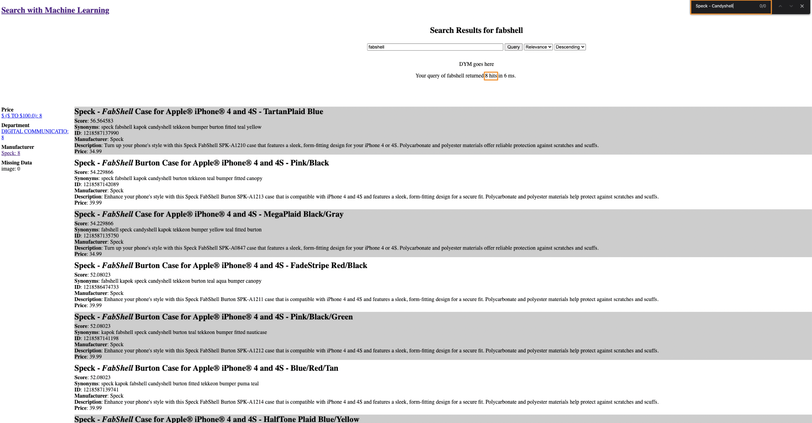
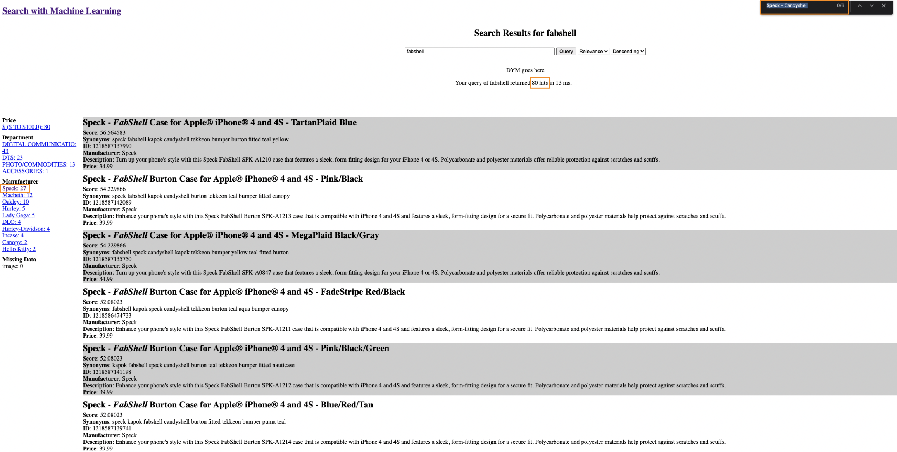
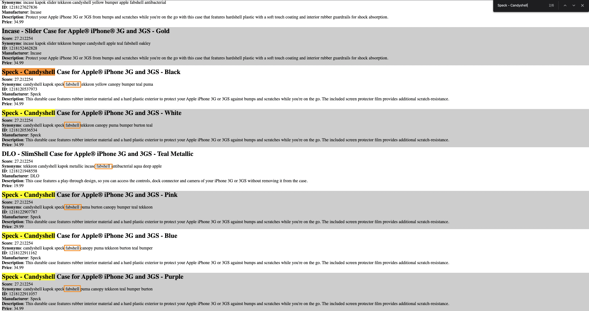
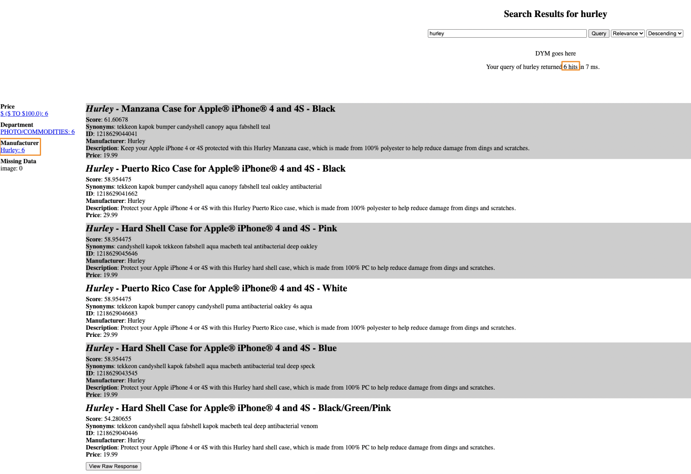
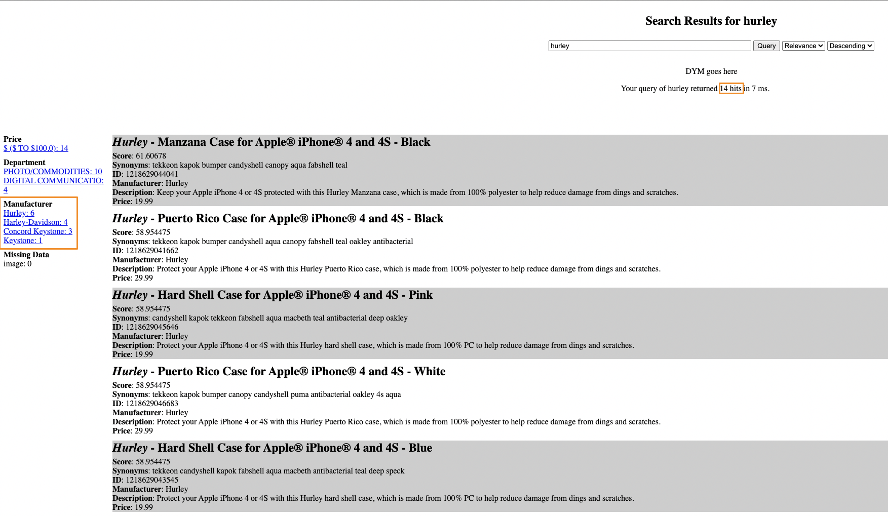
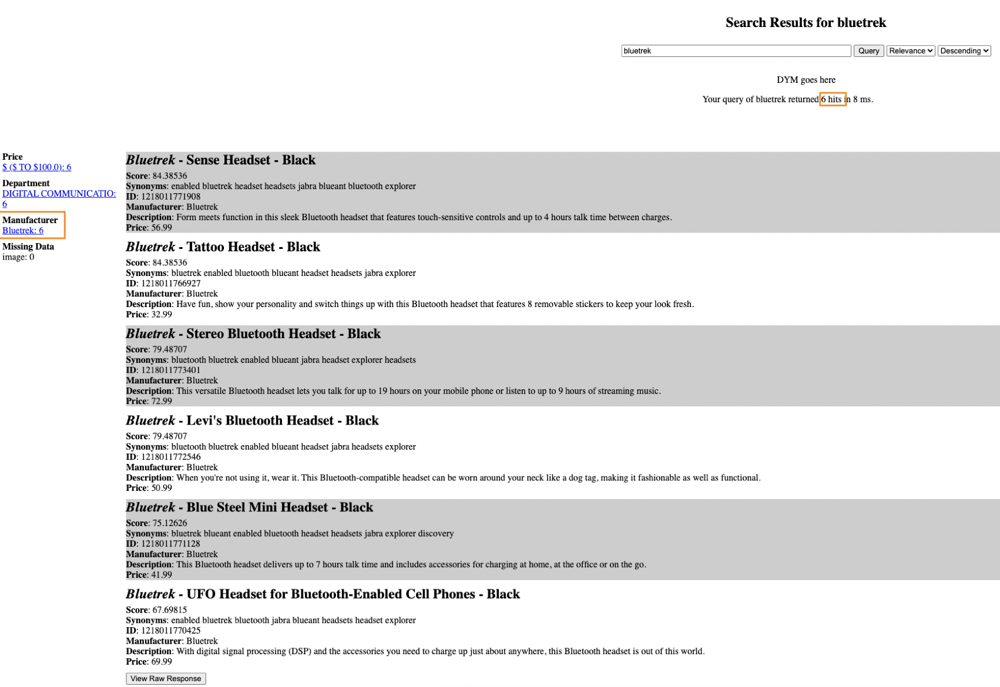
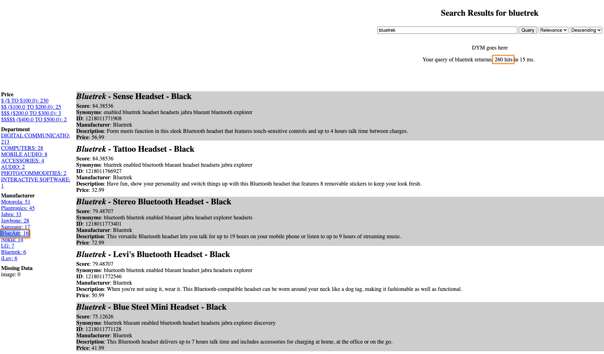
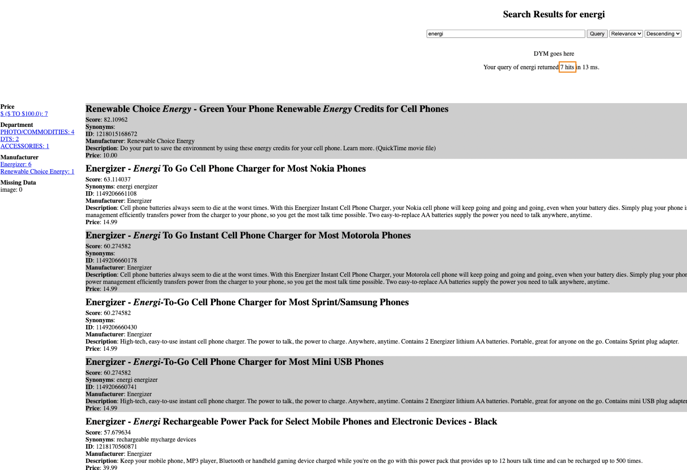
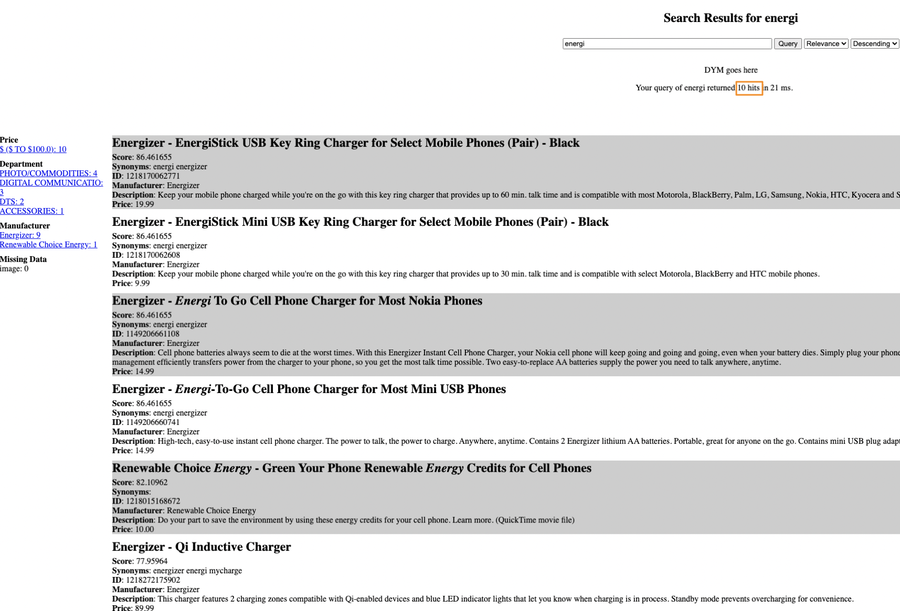

# Week 3 Project Report

## Level 1: Classifying Product Names to Categories

### Prepare Train & Test Data

#### Extraction from the Products XML Files

```
python week3/createContentTrainingData.py --output /workspace/datasets/categories/categories.fasttext --min_products 10
```

```transform_product```:

- Punctuations removal
- Lower casing
- English stemming

```python
import nltk
from nltk.stem import SnowballStemmer
nltk.download("punkt")
tokenizer = nltk.RegexpTokenizer(r"\w+")
stemmer = SnowballStemmer("english")


def transform_name(product_name):
    clean_product_name = " ".join([stemmer.stem(token.lower()) for token in tokenizer.tokenize(product_name)])
    print(f"transform: {product_name} --> {clean_product_name}")
    return clean_product_name
```

#### Shuffle

```shell
shuf /workspace/datasets/categories/categories.fasttext --output /workspace/datasets/categories/categories.fasttext.shuffled
```

#### Train Data

```shell
head -n 50000 /workspace/datasets/categories/categories.fasttext.shuffled > /workspace/datasets/categories/categories.train
```

##### Train Data EDA

I inspected the content of the extracted titles by loading them into a Pandas dataframe, as shown below:

```python
import pandas as pd

train_df = pd.read_csv("categories.train", header=None)
train_df.info()
train_df.head()
train_df.columns = ['sample']
train_df['label'] = train_df.apply(lambda x: x['sample'].split()[0], axis = 1)
train_df.info()
train_df.head()
```

#### Test Data

```shell
tail -n 50000 /workspace/datasets/categories/categories.fasttext.shuffled > /workspace/datasets/categories/categories.train
```

### Train Model

```shell
~/fastText-0.9.2/fasttext supervised -input /workspace/datasets/categories/categories.train -output model_categories -lr 1.0 -epoch 20 -wordNgrams 2

Read 0M words
Number of words:  15892
Number of labels: 1273
Progress: 100.0% words/sec/thread:     802 lr:  0.000000 avg.loss:  0.493649 ETA:   0h 0m 0s
```

### Test Model

```
~/fastText-0.9.2/fasttext test model_categories.bin /workspace/datasets/categories/categories.test

N       50000
P@1     0.77
R@1     0.77
```

### Test the model with ad hoc examples

One at a time:

```
~/fastText-0.9.2/fasttext predict model_categories.bin -
```

## Level 2: Derive Synonyms from Content

### Run extractTitles.py as is

```shell
python ./week3/extractTitles.py

gitpod /workspace/search_with_machine_learning_course $ head /workspace/datasets/fasttext/titles.txt
NuForce - Icon uDAC-2 USB Audio Receiver and Digital-to-Analog Converter - Red
NuForce - Icon uDAC-2 USB Audio Receiver and Digital-to-Analog Converter - Silver
Sungale - Beam E-Reader - White
Wipeout 2048 - PS Vita
Akai - Refurbished Professional 25-Key Keyboard Controller
Memorex - Slim Jewel Cases (50-pack) - Assorted
Outdoors Unleashed: Africa 3D - Nintendo 3DS
Heavy Fire: Afghanistan - Nintendo Wii
Apple - $25 iTunes Gift Card
Toshiba - Satellite Laptop / Intel® Core™ i3 Processor / 17.3" Display - Matrix Graphite

(search_with_ml_week3) gitpod /workspace/search_with_machine_learning_course $ wc -l /workspace/datasets/fasttext/titles.txt
11620 /workspace/datasets/fasttext/titles.txt
```

### Unsupervised Model Training

```shell
(search_with_ml_week3) gitpod /workspace/search_with_machine_learning_course $ ~/fastText-0.9.2/fasttext skipgram -input /workspace/datasets/fasttext/titles.txt -output /workspace/datasets/fasttext/title_model
Read 0M words
Number of words:  2253
Number of labels: 0
Progress: 100.0% words/sec/thread:    3535 lr:  0.000000 avg.loss:  2.629022 ETA:   0h 0m 0s
```

#### Ad-Hoc Testing

See also ```test_titles_model.sh.log```.

## Level 3: Integrating Synonyms with Search

### Extract Phone Products Names

```shell
gitpod /workspace/search_with_machine_learning_course $ pyenv activate search_with_ml_week3
(search_with_ml_week3) gitpod /workspace/search_with_machine_learning_course $ python ./week3/extractTitles.py --input /workspace/search_with_machine_learning_course/week3/phone_products --sample_rate 1.0  --output /workspace/datasets/fasttext/phone_titles_2.txt
[nltk_data] Downloading package punkt to /home/gitpod/nltk_data...
[nltk_data]   Unzipping tokenizers/punkt.zip.
Reading products from /workspace/search_with_machine_learning_course/week3/phone_products
Sample rate=1.0, stem=False
Writing results to /workspace/datasets/fasttext/phone_titles_2.txt
4862 titles extracted.
```

### Train the Phone Products Titles fastText Model

```shell
(search_with_ml_week3) gitpod /workspace/search_with_machine_learning_course $ ~/fastText-0.9.2/fasttext skipgram -input /workspace/datasets/fasttext/phone_titles.txt -output /workspace/datasets/fasttext/phone_model -epoch 25
Read 0M words
Number of words:  691
Number of labels: 0
Progress: 100.0% words/sec/thread:   12917 lr:  0.000000 avg.loss:  2.139039 ETA:   0h 0m 0s
```

### Ad-Hoc Testing of the Phone Products Titles fastText Model

```shell
(search_with_ml_week3) gitpod /workspace/search_with_machine_learning_course $ ./week3/test_titles_model.sh -m /workspace/datasets/fasttext/phone_model.bin -t 0.9
++ python ./week3/testTitleModel.py --model /workspace/datasets/fasttext/phone_model.bin --threshold 0.9
[nltk_data] Downloading package punkt to /home/gitpod/nltk_data...
[nltk_data]   Package punkt is already up-to-date!

***** Loading model /workspace/datasets/fasttext/phone_model.bin with...
Warning : `load_model` does not return WordVectorModel or SupervisedModel any more, but a `FastText` object which is very similar.
Model <fasttext.FastText._FastText object at 0x7f3d9ea85280> loaded.
stem=False, k=10, nn_threashold=0.9

***** Product types:

laptops (raw=laptops) neighbors (k=10):
        laptop (0.9946858286857605)
        6 (0.9141654372215271)

monitors (raw=monitors) neighbors (k=10):

keyboards (raw=keyboards) neighbors (k=10):
        concord (0.9274969100952148)
        keystone (0.9183887243270874)
        eco (0.9176569581031799)
        nauticase (0.9095285534858704)

printers (raw=printers) neighbors (k=10):

headphones (raw=headphones) neighbors (k=10):
        earbud (0.977368175983429)
        earpollution (0.9526700973510742)
        jammin (0.9261226058006287)
        house (0.9165775775909424)
        ozone (0.9115431904792786)
        luxe (0.9076652526855469)
        microphone (0.901847779750824)

***** Brands:

apple (raw=Apple) neighbors (k=10):
        iphone (0.945033073425293)
        kapok (0.9223731160163879)
        4 (0.9205688238143921)
        teal (0.9161614179611206)
        4s (0.9102899432182312)

toshiba (raw=Toshiba) neighbors (k=10):

hp (raw=HP) neighbors (k=10):
        organizers (0.9918403625488281)
        ipaq (0.979442298412323)
        handheld (0.9788981676101685)
        pdas (0.955308735370636)
        replacement (0.951253354549408)
        polymer (0.9139149785041809)
        lithium (0.911292552947998)
        lenmar (0.9085922241210938)
        handspring (0.9054775238037109)

sony (raw=Sony) neighbors (k=10):
        ericsson (0.9414438009262085)

dell (raw=Dell) neighbors (k=10):

***** Models:

iphone (raw=iPhone) neighbors (k=10):
        apple (0.9450328946113586)

ipad (raw=ipad) neighbors (k=10):
        ipod (0.957098126411438)
        video (0.9377815127372742)
        potato (0.9219337105751038)
        uniquesync (0.912337601184845)

thinkpad (raw=ThinkPad) neighbors (k=10):

macbook (raw=macbook) neighbors (k=10):
        macbeth (0.9610511064529419)
        aqua (0.9542038440704346)
        venom (0.9448283314704895)
        antibacterial (0.9442696571350098)
        candyshell (0.9348767399787903)
        fabshell (0.9305251240730286)
        tekkeon (0.923850417137146)
        deep (0.9232609272003174)
        kapok (0.9107840061187744)
        hurley (0.9078370928764343)

inspiron (raw=inspiron) neighbors (k=10):
        inspire (0.9423329830169678)
        hd (0.9155171513557434)

***** Attributes:

black (raw=black) neighbors (k=10):

portable (raw=portable) neighbors (k=10):

battery (raw=battery) neighbors (k=10):
        lenmar (0.9467871785163879)
        lithium (0.9336376786231995)
        replacement (0.9326379895210266)
        polymer (0.918221116065979)

***** Others:

fabshell (raw=fabshell) neighbors (k=10):
        candyshell (0.9756165146827698)
        speck (0.96562260389328)
        burton (0.9575952887535095)
        kapok (0.9550991058349609)
        teal (0.9487518668174744)
        fitted (0.9464547038078308)
        macbeth (0.9405268430709839)
        oakley (0.9396384954452515)
        antibacterial (0.9358007311820984)
        nauticase (0.9245768189430237)

hurley (raw=hurley) neighbors (k=10):
        oakley (0.98380047082901)
        harley (0.9606829285621643)
        puma (0.9446458220481873)
        kapok (0.9386962056159973)
        canopy (0.935887336730957)
        eco (0.9293815493583679)
        nauticase (0.9260969758033752)
        candyshell (0.9245275259017944)
        burton (0.9193117618560791)
        lady (0.9182815551757812)

bluetrek (raw=bluetrek) neighbors (k=10):
        blueant (0.9779480695724487)
        bluetooth (0.9718143939971924)
        enabled (0.9301869869232178)
        blu (0.9210882782936096)
        discovery (0.9179058074951172)
        headset (0.9082444310188293)

energi (raw=energi) neighbors (k=10):
        energizer (0.9870834946632385)
        to (0.9043470025062561)
```

### Integration with Search

#### week3/\_init\_.py

```python
SYNS_MODEL_LOC = os.environ.get("SYNONYMS_MODEL_LOC", "/workspace/datasets/fasttext/phone_model.bin")
print("SYNONYMS_MODEL_LOC: %s" % SYNS_MODEL_LOC)
if SYNS_MODEL_LOC and os.path.isfile(SYNS_MODEL_LOC):
    app.config["syns_model"] = fasttext.load_model(SYNS_MODEL_LOC)

    # TODO: Get the settings from an env. variable
    app.config["syns_model_stemmed"] = False
    app.config["syns_model_nn_k"] = 10

    SYNS_MODEL_KNN_THRESHOLD = os.environ.get("SYNS_MODEL_KNN_THRESHOLD", "0.90")
    app.config["syns_model_nn_threshold"] = float(SYNS_MODEL_KNN_THRESHOLD)
    print("SYNS_MODEL_KNN_THRESHOLD: %s" % SYNS_MODEL_KNN_THRESHOLD)
else:
    print("No synonym model found.  Have you run fasttext?")
app.config["index_name"] = os.environ.get("INDEX_NAME", "bbuy_annotations")
```

#### documents.py

```python
def annotate():
    debug = False
    if request.mimetype == 'application/json':
        the_doc = request.get_json()
        response = {}
        cat_model = current_app.config.get("cat_model", None) # see if we have a category model
        syns_model = current_app.config.get("syns_model", None) # see if we have a synonyms/analogies model
        # We have a map of fields to annotate.  Do POS, NER on each of them
        sku = the_doc["sku"] if "sku" in the_doc.keys() else "n/a"
        for item in the_doc:
            the_text = the_doc[item]
            if the_text is not None and the_text.find("%{") == -1:
                if item == "name":
                    if syns_model is not None:
                        if debug: print(f"[sku={sku}] IMPLEMENTED: call nearest_neighbors on your syn model and return it as `name_synonyms`")
                        # Get the nearest neighbors
                        titles_model = current_app.config["syns_model"]
                        stem = current_app.config["syns_model_stemmed"]
                        nn_k = current_app.config["syns_model_nn_k"]
                        nn_threshold = current_app.config["syns_model_nn_threshold"]
                        if stem:
                            analyzed_text = " ".join([stemmer.stem(token.lower()) for token in tokenizer.tokenize(the_text)])
                            print(f"\t[sku={sku}] transform: {the_text} --> {analyzed_text}")
                        else:
                            analyzed_text = " ".join([token.lower() for token in tokenizer.tokenize(the_text)])

                        neighbors = titles_model.get_nearest_neighbors(analyzed_text, k=nn_k)
                        print(f"\n[sku={sku}] {analyzed_text} (raw={the_text}, neighbors (k={nn_k}):")
                        nn_list = []
                        for neighbor in neighbors:
                            neighbor_score = neighbor[0]
                            neighbor_text = neighbor[1]
                            if neighbor_score >= nn_threshold:
                                print(f"\t{neighbor_text} ({neighbor_score}) [>= threshold {nn_threshold}]")
                                nn_list.append(neighbor_text)
                            else:
                                print(f"\t{neighbor_text} ({neighbor_score})")
                        
                        syns_text = ' '.join(nn_list)
                        print(f"\tsyns_text={syns_text}")
                        response[f'{item}_synonyms'] = syns_text
        return jsonify(response)
    abort(415)
```

#### document/annotate Testing

Start the Flask-based document annotation service:

```shell
gitpod /workspace/search_with_machine_learning_course $ pyenv activate search_with_ml_week3
(search_with_ml_week3) gitpod /workspace/search_with_machine_learning_course $ export FLASK_APP=week3
(search_with_ml_week3) gitpod /workspace/search_with_machine_learning_course $ export SYNONYMS_MODEL_LOC=/workspace/datasets/fasttext/phone_model.bin
(search_with_ml_week3) gitpod /workspace/search_with_machine_learning_course $ flask run --port 5000
 * Serving Flask app 'week3' (lazy loading)
 * Environment: development
 * Debug mode: on
PRIOR CLICKS: /workspace/ltr_output/train.csv
No prior clicks to load.  This may effect quality. Run ltr-end-to-end.sh per week 2 if you want
SYNONYMS_MODEL_LOC: /workspace/datasets/fasttext/phone_model.bin
Warning : `load_model` does not return WordVectorModel or SupervisedModel any more, but a `FastText` object which is very similar.
SYNS_MODEL_KNN_THRESHOLD: 0.90
[nltk_data] Downloading package punkt to /home/gitpod/nltk_data...
[nltk_data]   Package punkt is already up-to-date!
 * Running on http://127.0.0.1:5000/ (Press CTRL+C to quit)
 * Restarting with stat
 * Debugger is active!
 * Debugger PIN: 435-874-441
PRIOR CLICKS: /workspace/ltr_output/train.csv
No prior clicks to load.  This may effect quality. Run ltr-end-to-end.sh per week 2 if you want
SYNONYMS_MODEL_LOC: /workspace/datasets/fasttext/phone_model.bin
Warning : `load_model` does not return WordVectorModel or SupervisedModel any more, but a `FastText` object which is very similar.
SYNS_MODEL_KNN_THRESHOLD: 0.90
[nltk_data] Downloading package punkt to /home/gitpod/nltk_data...
[nltk_data]   Package punkt is already up-to-date!
```

Ad-Hoc Testing:

- q=fabshell
- Expecting: "Speck CandyShell" products

Let's verify that the "Speck CandyShell" titles have "fabshell" as a synonym:

```shell
(search_with_ml_week3) gitpod /workspace/search_with_machine_learning_course $ grep -i CandyShell /workspace/datasets/fasttext/phone_titles.txt 
speck candyshell card case for apple iphone 4 nightdrive gray
speck candyshell case for apple iphone 3g and 3gs black
speck candyshell case for apple iphone 3g and 3gs white
speck candyshell case for apple iphone 3g and 3gs pink
speck candyshell case for apple iphone 3g and 3gs blue
speck candyshell case for apple iphone 3g and 3gs purple
(search_with_ml_week3) gitpod /workspace/search_with_machine_learning_course $ curl -XPOST http://localhost:5000/documents/annotate -H "Content-Type:application/json" -d '{"name": "speck candyshell case for apple iphone" }'
{
  "name_synonyms": "kapok candyshell speck canopy fabshell tekkeon puma teal yellow bumper"
}
```

- q=hurley
- expecting: Hard cases like Oakley

Let's verify that the "Oakley case" titles have "hurley" as a synonym:

```shell
(search_with_ml_week3) gitpod /workspace/search_with_machine_learning_course $ grep -i Oakley /workspace/datasets/fasttext/phone_titles.txt 
oakley o matter case for apple iphone 4 red line
oakley hazard case for apple iphone 4 black
oakley hazard case for apple iphone 4 red
oakley unobtainium case for apple iphone 4 black
oakley o matter case for apple iphone 4 black
oakley o matter case for apple iphone 4 and 4s white
oakley o matter case for apple iphone 4 and 4s sheet metal
oakley unobtainium case for apple iphone 4 and 4s red line
oakley unobtainium case for apple iphone 4 and 4s sheet metal
oakley unobtainium case for apple iphone 4 and 4s white
oakley hazard case for apple iphone 4 and 4s jet black
oakley cylinder block case for apple iphone 4 and 4s black
(search_with_ml_week3) gitpod /workspace/search_with_machine_learning_course $ curl -XPOST http://localhost:5000/documents/annotate -H "Content-Type:application/json" -d '{"name": "oakley case for apple iphone" }'
{
  "name_synonyms": "iphone apple 4s kapok tekkeon canopy teal 4 bumper deep"
}
```

Oops, "oakley case for apple iphone" does not have "hurley" as a 10-NN neighbor!

- q=bluetrek
- expecting: bluetooth headsets like those from BlueAnt

Let's verify that the "BlueAnt bluetooth headsets" titles have "bluetrek" as a synonym:

```shell
(search_with_ml_week3) gitpod /workspace/search_with_machine_learning_course $ curl -XPOST http://localhost:5000/documents/annotate -H "Content-Type:application/json" -d '{"name": "BlueAnt bluetooth headsets" }'
{
  "name_synonyms": "bluetooth enabled bluetrek blueant headset jabra headsets explorer"
}
```

- q=energi
- expecting: bluetooth headsets like those from BlueAnt

Let's verify that the other "Energizer chargers" titles have "energi" as a synonym:

```shell
(search_with_ml_week3) gitpod /workspace/search_with_machine_learning_course $ curl -XPOST http://localhost:5000/documents/annotate -H "Content-Type:application/json" -d '{"name": "Energizer chargers" }'
{
  "name_synonyms": "energizer energi mycharge"
}
```


## Level 4: ...


# Self-Assessment

## For classifying product names to categories:
### What precision (P@1) were you able to achieve?

```
N       50000
P@1     0.77
R@1     0.77
```

### What fastText parameters did you use?

```shell
~/fastText-0.9.2/fasttext supervised -input /workspace/datasets/categories/categories.train -output model_categories -lr 1.0 -epoch 20 -wordNgrams 2

Read 0M words
Number of words:  15892
Number of labels: 1273
Progress: 100.0% words/sec/thread:     802 lr:  0.000000 avg.loss:  0.493649 ETA:   0h 0m 0s
```

### How did you transform the product names?

- Punctuations removal
- Lower casing
- English stemming

```python
import nltk
from nltk.stem import SnowballStemmer
nltk.download("punkt")
tokenizer = nltk.RegexpTokenizer(r"\w+")
stemmer = SnowballStemmer("english")

def transform_name(product_name):
    clean_product_name = " ".join([stemmer.stem(token.lower()) for token in tokenizer.tokenize(product_name)])
    print(f"transform: {product_name} --> {clean_product_name}")
    return clean_product_name
```

### How did you prune infrequent category labels, and how did that affect your precision?

I used a category min count of 10:

```
python week3/createContentTrainingData.py --output /workspace/datasets/categories/categories.fasttext --min_products 10
```

The implementation of the pruning goes as follows:

1. In a first loop, all the categories information is loaded into a Python dictionary with keys:
    - ```name```: Category's label;
    - ```count```: Number of times the category is encountered in the input;
    - ```products```: List of products' names associated with the category. 
2. In a second loop, the content of the categories dictionary is written to the output with a condition for each category that the count be greater than the passed in min counts argument, as shown below (see ```if v['count'] >= min_products```):

```python
excluded_count = 0
with open(output_file, 'w') as output:
    with open(categories_file, 'w') as categories_output:
        for k,v in categories_dict.items():
            excluded = True
            if v['count'] >= min_products:
                excluded = False
                products = v['products']
                for product in products:
                    product_name_transformed = transform_name(product)
                    label_to_product_name = f"__label__{k} {product_name_transformed}"
                    output.write(f"{label_to_product_name}\n")
            else:
                excluded_count += 1

            categories_output.write(f"__label__{k}\t{v['count']}\t{excluded}\t{v['name']}\n")

print(f"{excluded_count} categories excluded")
```

#### Other Min Counts Experiments

All experiments were run with a 50K/50K train/test samples split. Increasing the min count from 1 to 10, 20, and 50 showed improvement in the text every time. I stopped the experiment at min count = 50.

**Min=1**

```shell
(search_with_ml_week3) gitpod /workspace/search_with_machine_learning_course $ ~/fastText-0.9.2/fasttext test model_categories_min_1.bin /workspace/datasets/categories/categories_min_1.test
N       49780
P@1     0.758
R@1     0.758
```

**Min=10**

```model_categories.bin``` was trained with min count = 10.

```shell
(search_with_ml_week3) gitpod /workspace/search_with_machine_learning_course $ ~/fastText-0.9.2/fasttext test model_categories.bin /workspace/datasets/categories/categories.test
N       50000
P@1     0.77
R@1     0.77
```

**Min=20**

```shell
(search_with_ml_week3) gitpod /workspace/search_with_machine_learning_course $ ~/fastText-0.9.2/fasttext test model_categories_min_20.bin /workspace/datasets/categories/categories_min_20.test
N       50000
P@1     0.789
R@1     0.789
```

**Min=50**

```shell
(search_with_ml_week3) gitpod /workspace/search_with_machine_learning_course $ ~/fastText-0.9.2/fasttext test model_categories_min_50.bin /workspace/datasets/categories/categories_min_50.test
N       45000
P@1     0.826
R@1     0.826
```

**Min=50, loss=hs**

Experimentation with ```loss=hs```, per this [recommendation](https://fasttext.cc/docs/en/supervised-tutorial.html#scaling-things-up).

**Train:**

Training time was significantly improved: ~1min vs. 5+ minutes for loss=softmax

```shell
(search_with_ml_week3) gitpod /workspace/search_with_machine_learning_course $ ~/fastText-0.9.2/fasttext supervised -input /workspace/datasets/categories/categories_min_50.train -output model_categories_min_50_loss_hs -loss hs -lr 1.0 -epoch 20 -wordNgrams 2
Read 0M words
Number of words:  14705
Number of labels: 520
Progress: 100.0% words/sec/thread:   20345 lr:  0.000000 avg.loss:  0.350199 ETA:   0h 0m 0s
```

**Test:**

Precision and Recall went down a bit. The ```loss=hs``` might be a good compromise between training speed and model's performance.

```shell
(search_with_ml_week3) gitpod /workspace/search_with_machine_learning_course $ ~/fastText-0.9.2/fasttext test model_categories_min_50_loss_hs.bin /workspace/datasets/categories/categories_min_50.test
N       45000
P@1     0.791
R@1     0.791
```

### How did you prune the category tree, and how did that affect your precision?

Based on the experiments at depth 2 and 3 documented below, the precision increases at the granularity of the learned categories decreases.

#### Depth=2

**Extraction:**

```shell
(search_with_ml_week3) gitpod /workspace/search_with_machine_learning_course $ python ./week3/createContentTrainingData.py --input ./data/pruned_products --output /workspace/datasets/categories/categories_min_50_depth_2.fasttext --min_products 50 --categories_depth 2[nltk_data] Downloading package punkt to /home/gitpod/nltk_data...
[nltk_data]   Package punkt is already up-to-date!
min_products=50, sample_rate=1.0, categories_depth=2
Writing labeled categories to: /workspace/datasets/categories/categories_min_50_depth_2.fasttext
Writing categories names to  : /workspace/datasets/categories/categories_names.txt
Processing pruned_products_1.xml
        19433 products processed.
Processing pruned_products_2.xml
        20786 products processed.
Processing pruned_products_3.xml
        19218 products processed.
Processing pruned_products_4.xml
        20542 products processed.
Processing pruned_products_5.xml
        19513 products processed.
Processing pruned_products_6.xml
        15866 products processed.
3 categories excluded

(search_with_ml_week3) gitpod /workspace/search_with_machine_learning_course $ shuf /workspace/datasets/categories/categories_min_50_depth_2.fasttext > /workspace/datasets/categories/categories_min_50_depth_2.fasttext.shuffled

(search_with_ml_week3) gitpod /workspace/search_with_machine_learning_course $ head -n 45000 /workspace/datasets/categories/categories_min_50_depth_2.fasttext.shuffled > /workspace/datasets/categories/categories_min_50_depth_2.train
(search_with_ml_week3) gitpod /workspace/search_with_machine_learning_course $ tail -n 45000 /workspace/datasets/categories/categories_min_50_depth_2.fasttext.shuffled > /workspace/datasets/categories/categories_min_50_depth_2.test
```

**Training, and Testing:**

```shell
(search_with_ml_week3) gitpod /workspace/search_with_machine_learning_course $ ~/fastText-0.9.2/fasttext supervised -input /workspace/datasets/categories/categories_min_50_depth_2.train -output model_categories_min_50_depth_2 -lr 1.0 -epoch 20 -wordNgrams 2
Read 0M words
Number of words:  15461
Number of labels: 17
Progress: 100.0% words/sec/thread:   18757 lr:  0.000000 avg.loss:  0.052052 ETA:   0h 0m 0s

(search_with_ml_week3) gitpod /workspace/search_with_machine_learning_course $ ~/fastText-0.9.2/fasttext test model_categories_min_50_depth_2.bin /workspace/datasets/categories/categories_min_50_depth_2.test
N       45000
P@1     0.952
R@1     0.952
```

#### Depth=3

**Extraction:**

```shell
(search_with_ml_week3) gitpod /workspace/search_with_machine_learning_course $ python ./week3/createContentTrainingData.py --input ./data/pruned_products --output /workspace/datasets/categories/categories_min_50_depth_3.fasttext --min_products 50 --categories_depth 3[nltk_data] Downloading package punkt to /home/gitpod/nltk_data...
[nltk_data]   Package punkt is already up-to-date!
min_products=50, sample_rate=1.0, categories_depth=3
Writing labeled categories to: /workspace/datasets/categories/categories_min_50_depth_3.fasttext
Writing categories names to  : /workspace/datasets/categories/categories_names.txt
Processing pruned_products_1.xml
        19433 products processed.
Processing pruned_products_2.xml
        20786 products processed.
Processing pruned_products_3.xml
        19218 products processed.
Processing pruned_products_4.xml
        20542 products processed.
Processing pruned_products_5.xml
        19513 products processed.
Processing pruned_products_6.xml
        15866 products processed.
93 categories excluded
```

**Training, and Testing:**

```shell
(search_with_ml_week3) gitpod /workspace/search_with_machine_learning_course $ ~/fastText-0.9.2/fasttext supervised -input /workspace/datasets/categories/categories_min_50_depth_3.train -output model_categories_min_50_depth_3 -lr 1.0 -epoch 20 -wordNgrams 2
Read 0M words
Number of words:  15348
Number of labels: 125
Progress: 100.0% words/sec/thread:    6168 lr:  0.000000 avg.loss:  0.089807 ETA:   0h 0m 0s

(search_with_ml_week3) gitpod /workspace/search_with_machine_learning_course $ ~/fastText-0.9.2/fasttext test model_categories_min_50_depth_3.bin /workspace/datasets/categories/categories_min_50_depth_3.test
N       45000
P@1     0.931
R@1     0.931
```

## Deriving Synonyms from Content

### What 20 tokens did you use for evaluation?

See also ```testTitleModel.py```.

The test tokens are shown below. The "others" group contains the test "synonyms" used in Level III.

```python
product_types = [
    "laptops",
    "monitors",
    "keyboards",
    "printers",
    "headphones"
]

brands = [
    "Apple",
    "Toshiba",
    "HP",
    "Sony",
    "Dell"
]

models = [
    "iPhone",
    "ipad",
    "ThinkPad",
    "macbook",
    "inspiron"
]

attributes = [
    "black",
    "portable",
    "battery",
]

others = [
    "fabshell",
    "hurley",
    "bluetrek",
    "energi"
]
```

### What fastText parameters did you use?

```shell
(search_with_ml_week3) gitpod /workspace/search_with_machine_learning_course $ ~/fastText-0.9.2/fasttext skipgram -input /workspace/datasets/fasttext/titles.txt -output /workspace/datasets/fasttext/title_model
Read 0M words
Number of words:  2253
Number of labels: 0
Progress: 100.0% words/sec/thread:    3535 lr:  0.000000 avg.loss:  2.629022 ETA:   0h 0m 0s
```

### How did you transform the product names?

- Replace punctuation with space;
- lower case.
- The use of stemming is optional, and yielded poorer results.

```python
def transform_training_data(name):
    if stem:
        analyzed_name = " ".join([stemmer.stem(token.lower()) for token in tokenizer.tokenize(name)])
        print(f"\ttransform: {name} --> {analyzed_name}")
    else:
        analyzed_name = " ".join([token.lower() for token in tokenizer.tokenize(name)])
    return analyzed_name
```

### What threshold score did you use?

0.90 (without stemming)
0.95 (wit stemming)

### What synonyms did you obtain for those tokens?

#### Without Stemming

```
gitpod /workspace/search_with_machine_learning_course $ ./week3/test_titles_model.sh -m /workspace/datasets/fasttext/title_model.bin -t 0.9
++ python ./week3/testTitleModel.py --model /workspace/datasets/fasttext/title_model.bin --threshold 0.9
[nltk_data] Downloading package punkt to /home/gitpod/nltk_data...
[nltk_data]   Package punkt is already up-to-date!

***** Loading model /workspace/datasets/fasttext/title_model.bin with...
Warning : `load_model` does not return WordVectorModel or SupervisedModel any more, but a `FastText` object which is very similar.
Model <fasttext.FastText._FastText object at 0x7fbf3e2a5190> loaded.
stem=False, k=10, nn_threashold=0.9

***** Product types:

laptops (raw=laptops) neighbors (k=10):
        laptop (0.9681161642074585)
        lenovo (0.9652937650680542)
        thinkpad (0.9598777890205383)
        notebook (0.9506425261497498)
        notebooks (0.9412961006164551)
        ideapad (0.9402307271957397)
        vaio (0.9369521141052246)
        accessory (0.9317877292633057)
        lithium (0.9209573268890381)
        toshiba (0.9209372401237488)

monitors (raw=monitors) neighbors (k=10):
        monitor (0.9876683950424194)
        package (0.9368032217025757)
        desk (0.9358944892883301)
        ghz (0.9221471548080444)
        refurbished (0.9212990403175354)
        factory (0.9180514812469482)
        samsonite (0.9128733277320862)
        64 (0.9115145206451416)
        desktop (0.9014427661895752)

keyboards (raw=keyboards) neighbors (k=10):
        keyboard (0.9899577498435974)
        keys (0.9791176915168762)
        cardinals (0.9738694429397583)
        key (0.9720028638839722)
        arizona (0.9685803055763245)
        louis (0.961910605430603)
        sox (0.9579365849494934)
        industries (0.954315185546875)
        rico (0.9542423486709595)
        executive (0.9524160027503967)

printers (raw=printers) neighbors (k=10):
        laser (0.9717273712158203)
        inkjet (0.9695612192153931)
        jet (0.9667848944664001)
        laserjet (0.9607283473014832)
        printer (0.9583544731140137)
        print (0.9568999409675598)
        ink (0.9532683491706848)
        network (0.9531980156898499)
        magenta (0.9373694062232971)
        interactive (0.932350218296051)

headphones (raw=headphones) neighbors (k=10):
        microphone (0.9630007147789001)
        headset (0.9450547695159912)
        ear (0.9396451711654663)
        contract (0.9361348748207092)
        niles (0.9336106181144714)
        phones (0.9316104054450989)
        cellular (0.9278435111045837)
        bluetooth (0.9178590178489685)
        iphone (0.9177078604698181)
        clear (0.9169378876686096)

***** Brands:

apple (raw=Apple) neighbors (k=10):
        4th (0.9795144200325012)
        skin (0.9788451790809631)
        griffin (0.9686033129692078)
        touch (0.9648669958114624)
        ipad (0.9641644954681396)
        generation (0.9627825021743774)
        3rd (0.9601157903671265)
        folio (0.9571356773376465)
        2nd (0.9486304521560669)
        4s (0.9439026713371277)

toshiba (raw=Toshiba) neighbors (k=10):
        factory (0.9784424304962158)
        xps (0.9768772125244141)
        64 (0.9716281294822693)
        pavilion (0.967585563659668)
        essentio (0.9671439528465271)
        ghz (0.9664316773414612)
        inspiron (0.9659632444381714)
        98 (0.9650441408157349)
        lenovo (0.961200475692749)
        x2 (0.9608892202377319)

hp (raw=HP) neighbors (k=10):
        i7 (0.9953325390815735)
        intel (0.993062436580658)
        pavilion (0.9922717213630676)
        aspire (0.9921656847000122)
        i3 (0.9920476078987122)
        ideacentre (0.9918755888938904)
        phenom (0.9902680516242981)
        athlon (0.9901157021522522)
        inspiron (0.9895945191383362)
        processor (0.9893380403518677)

sony (raw=Sony) neighbors (k=10):
        dcr (0.9677717089653015)
        lamp (0.9571700692176819)
        tiffany (0.9506719708442688)
        everio (0.9499626159667969)
        flash (0.9435830116271973)
        alpha (0.938090980052948)
        sdr (0.9366331100463867)
        tripod (0.9354820847511292)
        handycam (0.9350544810295105)
        pixma (0.9318295121192932)

dell (raw=Dell) neighbors (k=10):
        turion (0.9651697874069214)
        inspiron (0.964396595954895)
        xps (0.956716001033783)
        centrino (0.9505972266197205)
        laptop (0.9494810104370117)
        pavilion (0.9489441514015198)
        core (0.9484279751777649)
        athlon (0.9473860263824463)
        ideacentre (0.9457479119300842)
        intel (0.9430686831474304)

***** Models:

iphone (raw=iPhone) neighbors (k=10):
        phones (0.9733624458312988)
        phone (0.9673335552215576)
        motorola (0.9479029178619385)
        mobile (0.9349756836891174)
        microphone (0.9339984059333801)
        cell (0.9308091402053833)
        htc (0.9263744354248047)
        invisibleshield (0.9220721125602722)
        headphones (0.9177082180976868)
        zagg (0.9172875285148621)

ipad (raw=ipad) neighbors (k=10):
        folio (0.9879627227783203)
        skin (0.9835219383239746)
        3rd (0.9781063795089722)
        4th (0.9731414914131165)
        sleeve (0.9716528058052063)
        incase (0.9706749320030212)
        generation (0.9676355719566345)
        tribeca (0.9657695889472961)
        griffin (0.9653227925300598)
        apple (0.9641641974449158)

thinkpad (raw=ThinkPad) neighbors (k=10):
        notebooks (0.9870471358299255)
        notebook (0.9820085763931274)
        vaio (0.9677423238754272)
        lenovo (0.9659959077835083)
        98 (0.9659509658813477)
        ideapad (0.9633643627166748)
        matte (0.9626099467277527)
        laptops (0.9598779082298279)
        technology (0.9579793214797974)
        toshiba (0.9579576253890991)

macbook (raw=macbook) neighbors (k=10):
        nook (0.9848392605781555)
        songbook (0.9617215991020203)
        mouse (0.9485058784484863)
        charcoal (0.9483582973480225)
        matte (0.943253219127655)
        netbook (0.941543459892273)
        book (0.9395706653594971)
        state (0.9377545118331909)
        notebook (0.9377145767211914)
        piano (0.9376507997512817)

inspiron (raw=inspiron) neighbors (k=10):
        pavilion (0.9929970502853394)
        intel (0.9918909668922424)
        xps (0.9905765652656555)
        hp (0.9895944595336914)
        amd (0.9880238175392151)
        ideacentre (0.9860246777534485)
        turion (0.985883355140686)
        athlon (0.9849337339401245)
        x2 (0.984899640083313)
        i3 (0.9843177199363708)

***** Attributes:

black (raw=black) neighbors (k=10):
        blackjack (0.9124134182929993)

portable (raw=portable) neighbors (k=10):
        turntable (0.9451279640197754)
        retractable (0.9425462484359741)
        jensen (0.9189252853393555)
        polaroid (0.9106358885765076)
        audiovox (0.9072319269180298)
        universal (0.9066972136497498)
        karaoke (0.9063006639480591)
        university (0.9049748182296753)
        remote (0.902275562286377)

battery (raw=battery) neighbors (k=10):
        carry (0.9578219652175903)
        lithium (0.9479819536209106)
        camcorders (0.9407073259353638)
        cameras (0.9392815828323364)
        handycam (0.9353997111320496)
        tripod (0.9303295612335205)
        lenmar (0.9264706969261169)
        casio (0.9253305196762085)
        backpack (0.9198270440101624)
        carrying (0.9182804822921753)

***** Others:

fabshell (raw=fabshell) neighbors (k=10):
        shell (0.9745663404464722)
        hello (0.9630811810493469)
        incase (0.9559017419815063)
        mouse (0.9516762495040894)
        3g (0.9503904581069946)
        evo (0.9495596885681152)
        bookcase (0.9480561017990112)
        xentris (0.9471946954727173)
        minnesota (0.9457880258560181)
        sox (0.9455730319023132)

hurley (raw=hurley) neighbors (k=10):
        lorex (0.9711599946022034)
        fast (0.9697850346565247)
        urban (0.9689058661460876)
        lime (0.9682923555374146)
        support (0.9678326845169067)
        max (0.9662942886352539)
        psp (0.9660688638687134)
        nfl (0.9647215604782104)
        plantronics (0.9619628190994263)
        karaoke (0.9598007798194885)

bluetrek (raw=bluetrek) neighbors (k=10):
        clip (0.9783152937889099)
        sanyo (0.9782043099403381)
        bluetooth (0.9720638394355774)
        skullcandy (0.9711339473724365)
        armband (0.968256413936615)
        enabled (0.9634144902229309)
        navy (0.959943413734436)
        cellular (0.9587470889091492)
        retractable (0.9581921696662903)
        purple (0.9581412076950073)

energi (raw=energi) neighbors (k=10):
        cassette (0.9710025191307068)
        portfolio (0.9572863578796387)
        charger (0.9557331800460815)
        dlo (0.955043375492096)
        armband (0.9538418054580688)
        belkin (0.9523133039474487)
        grip (0.9518381357192993)
        griffin (0.9497214555740356)
        touch (0.9480659365653992)
        dock (0.9464833736419678)
```

#### With Stemming

Visually, using my test tokens, the stemming seems to produce less appealing synonyms. I proceeded wuth Level III without stemming.

```
gitpod /workspace/search_with_machine_learning_course $ ./week3/test_titles_model.sh -m /workspace/datasets/fasttext/title_stemmed_model.bin -t 0.95 -s
++ python ./week3/testTitleModel.py --model /workspace/datasets/fasttext/title_stemmed_model.bin --threshold 0.95 --stem
[nltk_data] Downloading package punkt to /home/gitpod/nltk_data...
[nltk_data]   Package punkt is already up-to-date!

***** Loading model /workspace/datasets/fasttext/title_stemmed_model.bin with...
Warning : `load_model` does not return WordVectorModel or SupervisedModel any more, but a `FastText` object which is very similar.
Model <fasttext.FastText._FastText object at 0x7effa51b0430> loaded.
stem=True, k=10, nn_threashold=0.95

***** Product types:
        transform: laptops --> laptop

laptop (raw=laptops) neighbors (k=10):
        pentium (0.9974871277809143)
        hp (0.9964451193809509)
        processor (0.9963492155075073)
        athlon (0.9961322546005249)
        i3 (0.9955967664718628)
        display (0.9947436451911926)
        drive (0.994630753993988)
        amd (0.9939562082290649)
        i5 (0.9932973384857178)
        inspiron (0.9931666254997253)
        transform: monitors --> monitor

monitor (raw=monitors) neighbors (k=10):
        screenlif (0.997291624546051)
        cctv (0.9966179132461548)
        insignia (0.9964804649353027)
        screensav (0.9962542653083801)
        mattescreen (0.9961305856704712)
        promonitor (0.996083676815033)
        72 (0.9953776001930237)
        plasmaclust (0.9952970743179321)
        37 (0.9952554702758789)
        52 (0.9951257705688477)
        transform: keyboards --> keyboard

keyboard (raw=keyboards) neighbors (k=10):
        sportboard (0.9989857077598572)
        board (0.9986207485198975)
        kenmark (0.9983612895011902)
        skootboard (0.9982997179031372)
        scoreboard (0.9982451796531677)
        snowboard (0.998004674911499)
        dashboard (0.997909665107727)
        headboard (0.9976925253868103)
        charm (0.9976359009742737)
        pet (0.9975544214248657)
        transform: printers --> printer

printer (raw=printers) neighbors (k=10):
        sprinter (0.9965108036994934)
        print (0.9916510581970215)
        interfac (0.9897812604904175)
        painter (0.9895337224006653)
        computer (0.9895043969154358)
        princ (0.9894609451293945)
        intercept (0.9889674782752991)
        acer (0.9888508319854736)
        intersect (0.9883506298065186)
        printmast (0.9881119132041931)
        transform: headphones --> headphon

headphon (raw=headphones) neighbors (k=10):
        tracker (0.9971885085105896)
        headcas (0.9971866011619568)
        blocker (0.9967940449714661)
        gear (0.9967758059501648)
        year (0.9967556595802307)
        rocker (0.9965456128120422)
        trader (0.9963958263397217)
        warlock (0.9963890314102173)
        charger (0.996167778968811)
        earfit (0.996113657951355)

***** Brands:
        transform: Apple --> appl

appl (raw=Apple) neighbors (k=10):
        nppl (0.9963456988334656)
        ipad (0.9959391951560974)
        ipr (0.9955456256866455)
        ip (0.9949615597724915)
        ipaq (0.9946802854537964)
        generat (0.9920160174369812)
        jacket (0.990516722202301)
        iphon (0.9892703294754028)
        rocket (0.9891119599342346)
        touch (0.9885587096214294)
        transform: Toshiba --> toshiba

toshiba (raw=Toshiba) neighbors (k=10):
        atv (0.998678982257843)
        more (0.9982932209968567)
        icarplay (0.9977450966835022)
        desk (0.9975907206535339)
        clapton (0.9972999095916748)
        506 (0.9970716834068298)
        pay (0.9966968297958374)
        replay (0.9965267181396484)
        assort (0.9964345693588257)
        deskjet (0.9964070916175842)
        transform: HP --> hp

hp (raw=HP) neighbors (k=10):
        pavilion (0.9983652234077454)
        athlon (0.9982485175132751)
        i3 (0.9976634979248047)
        inspiron (0.9973910450935364)
        i5 (0.9970383048057556)
        amd (0.9967506527900696)
        laptop (0.9964451193809509)
        display (0.99624103307724)
        processor (0.9962223172187805)
        pentium (0.9954351782798767)
        transform: Sony --> soni

soni (raw=Sony) neighbors (k=10):
        pc6400 (0.9936124682426453)
        3200 (0.9935312271118164)
        6400 (0.9935207962989807)
        ed (0.9935204982757568)
        50d (0.9932027459144592)
        1200 (0.9931273460388184)
        10600 (0.993123471736908)
        hattera (0.9929895997047424)
        kyocera (0.9926006197929382)
        1600 (0.99247145652771)
        transform: Dell --> dell

dell (raw=Dell) neighbors (k=10):
        intellig (0.9939274787902832)
        inspir (0.993386447429657)
        inspiron (0.9928569197654724)
        intellifax (0.9926691055297852)
        amd (0.9918355941772461)
        intern (0.9915704727172852)
        atg (0.9905262589454651)
        comput (0.9900547862052917)
        core (0.9899007081985474)
        intellimous (0.9892085194587708)

***** Models:
        transform: iPhone --> iphon

iphon (raw=iPhone) neighbors (k=10):
        ipr (0.9957384467124939)
        ip (0.9935899376869202)
        nppl (0.9931308031082153)
        generat (0.993083119392395)
        ipar (0.992564857006073)
        epiphon (0.9921399354934692)
        ipaq (0.9916842579841614)
        ipad (0.991230309009552)
        pocket (0.9904859662055969)
        jack (0.9904060363769531)
        transform: ipad --> ipad

ipad (raw=ipad) neighbors (k=10):
        ipaq (0.9978333115577698)
        nppl (0.9962598085403442)
        appl (0.995938777923584)
        ip (0.9952276945114136)
        jacket (0.9951995015144348)
        ipr (0.994572103023529)
        rocket (0.9943071007728577)
        folio (0.9941324591636658)
        generat (0.993724524974823)
        socket (0.9934782385826111)
        transform: ThinkPad --> thinkpad

thinkpad (raw=ThinkPad) neighbors (k=10):
        gridiron (0.9994063377380371)
        quattron (0.9992849230766296)
        oblivion (0.9991850852966309)
        note (0.9991845488548279)
        entri (0.9990700483322144)
        eve (0.9990307688713074)
        delta (0.9990089535713196)
        xentri (0.9990019798278809)
        atrium6 (0.9988781809806824)
        reunion (0.99884033203125)
        transform: macbook --> macbook

macbook (raw=macbook) neighbors (k=10):
        livebook (0.9987726807594299)
        book (0.998443603515625)
        bookbook (0.9984278082847595)
        centurion (0.9979654550552368)
        quad (0.9978911876678467)
        turion (0.9977452158927917)
        lap (0.9976010918617249)
        lifebook (0.9974626302719116)
        facebook (0.9973756074905396)
        songbook (0.9971640110015869)
        transform: inspiron --> inspiron

inspiron (raw=inspiron) neighbors (k=10):
        hp (0.9973909258842468)
        pavilion (0.9967402815818787)
        athlon (0.9963908195495605)
        inspir (0.9962226748466492)
        amd (0.9961712956428528)
        display (0.9958970546722412)
        processor (0.9958526492118835)
        i5 (0.9954371452331543)
        intel (0.9942626357078552)
        i3 (0.994239866733551)

***** Attributes:
        transform: black --> black

black (raw=black) neighbors (k=10):
        geod (0.9963386058807373)
        blackwatch (0.9963160753250122)
        gem (0.9962277412414551)
        verilux (0.9961279630661011)
        trash (0.9960913062095642)
        blackhawk (0.9959099888801575)
        nash (0.9959017634391785)
        sli (0.9957627654075623)
        blade (0.9957621693611145)
        nonprofit (0.995695948600769)
        transform: portable --> portabl

portabl (raw=portable) neighbors (k=10):
        porta (0.998844563961029)
        import (0.998455286026001)
        podcastudio (0.9984477758407593)
        baronet (0.9984315037727356)
        skinpro (0.9983607530593872)
        charli (0.9983341693878174)
        portfolio (0.9982302188873291)
        aerosport (0.998136579990387)
        nero (0.9981293678283691)
        timeport (0.9980625510215759)
        transform: battery --> batteri

batteri (raw=battery) neighbors (k=10):
        card (0.9929467439651489)
        tripod (0.9913745522499084)
        ip100 (0.9901121854782104)
        s6200 (0.9900817275047302)
        n200 (0.9897904396057129)
        s8200 (0.9895009398460388)
        6200 (0.9893267154693604)
        x200 (0.9892414808273315)
        a2200 (0.9890545606613159)
        8200 (0.9883942604064941)

***** Others:
        transform: fabshell --> fabshel

fabshel (raw=fabshell) neighbors (k=10):
        minohd (0.999590277671814)
        snuggi (0.9995179176330566)
        milwauke (0.9994937181472778)
        rubik (0.9994684457778931)
        skype (0.9994661211967468)
        v205 (0.9994655251502991)
        aggi (0.9994619488716125)
        mvp (0.9994542598724365)
        mx (0.9994438290596008)
        huski (0.9994394779205322)
        transform: hurley --> hurley

hurley (raw=hurley) neighbors (k=10):
        groov (0.999751627445221)
        snapbox (0.999711275100708)
        pik003 (0.9997096657752991)
        minnesota (0.9996955394744873)
        retribut (0.9996933937072754)
        abbey (0.9996874332427979)
        ferox (0.9996756911277771)
        techbox (0.999674379825592)
        piccolo (0.9996736645698547)
        crackl (0.9996556639671326)
        transform: bluetrek --> bluetrek

bluetrek (raw=bluetrek) neighbors (k=10):
        qlip (0.9994039535522461)
        nokia (0.9993957281112671)
        energi (0.9993824362754822)
        dlo (0.9993188977241516)
        ihip (0.9992116093635559)
        lip (0.9991812109947205)
        yurbud (0.9990124106407166)
        velvet (0.9989697933197021)
        iklip (0.9989402294158936)
        outfitt (0.9989389777183533)
        transform: energi --> energi

energi (raw=energi) neighbors (k=10):
        dlo (0.9996012449264526)
        qlip (0.9995445609092712)
        ihip (0.9994337558746338)
        lip (0.9993546605110168)
        gripclip (0.9993188381195068)
        ship (0.9992572069168091)
        skinni (0.9992039203643799)
        nokia (0.9992026686668396)
        apc (0.9991609454154968)
        outfitt (0.9991143345832825)
```

## For integrating synonyms with search:

### Ingestion of Synonyms

The following changes were made to support ingestion of synonyms:

- Added the field "name_synpnyms" in OpenSearch to support text searching:
```json
      "name_synonyms": {
        "type": "text",
        "analyzer": "english",
        "fields": {
          "hyphens": {
            "type": "text",
            "analyzer": "smarter_hyphens"
          },
          "suggest": {
            "type": "completion"
          }

        }
      }
```

- The annotation request in documents.py was implemented:
```python
def annotate():
    debug = False
    if request.mimetype == 'application/json':
        the_doc = request.get_json()
        response = {}
        cat_model = current_app.config.get("cat_model", None) # see if we have a category model
        syns_model = current_app.config.get("syns_model", None) # see if we have a synonyms/analogies model
        # We have a map of fields to annotate.  Do POS, NER on each of them
        sku = the_doc["sku"] if "sku" in the_doc.keys() else "n/a"
        for item in the_doc:
            the_text = the_doc[item]
            if the_text is not None and the_text.find("%{") == -1:
                if item == "name":
                    if syns_model is not None:
                        if debug: print(f"[sku={sku}] IMPLEMENTED: call nearest_neighbors on your syn model and return it as `name_synonyms`")
                        # Get the nearest neighbors
                        titles_model = current_app.config["syns_model"]
                        stem = current_app.config["syns_model_stemmed"]
                        nn_k = current_app.config["syns_model_nn_k"]
                        nn_threshold = current_app.config["syns_model_nn_threshold"]
                        if stem:
                            analyzed_text = " ".join([stemmer.stem(token.lower()) for token in tokenizer.tokenize(the_text)])
                            print(f"\t[sku={sku}] transform: {the_text} --> {analyzed_text}")
                        else:
                            analyzed_text = " ".join([token.lower() for token in tokenizer.tokenize(the_text)])

                        neighbors = titles_model.get_nearest_neighbors(analyzed_text, k=nn_k)
                        print(f"\n[sku={sku}] {analyzed_text} (raw={the_text}, neighbors (k={nn_k}):")
                        nn_list = []
                        for neighbor in neighbors:
                            neighbor_score = neighbor[0]
                            neighbor_text = neighbor[1]
                            if neighbor_score >= nn_threshold:
                                print(f"\t{neighbor_text} ({neighbor_score}) [>= threshold {nn_threshold}]")
                                nn_list.append(neighbor_text)
                            else:
                                print(f"\t{neighbor_text} ({neighbor_score})")
                        
                        syns_text = ' '.join(nn_list)
                        print(f"\tsyns_text={syns_text}")
                        response[f'{item}_synonyms'] = syns_text
        return jsonify(response)
```
- The annotation service was run on port 5000:
```shell
gitpod /workspace/search_with_machine_learning_course $ pyenv activate search_with_ml_week3
pyenv-virtualenv: prompt changing will be removed from future release. configure `export PYENV_VIRTUALENV_DISABLE_PROMPT=1' to simulate the behavior.
(search_with_ml_week3) gitpod /workspace/search_with_machine_learning_course $ export FLASK_ENV=development
(search_with_ml_week3) gitpod /workspace/search_with_machine_learning_course $ export FLASK_APP=week3
(search_with_ml_week3) gitpod /workspace/search_with_machine_learning_course $ export SYNONYMS_MODEL_LOC=/workspace/datasets/fasttext/phone_model.bin
(search_with_ml_week3) gitpod /workspace/search_with_machine_learning_course $ flask run --port 5000
 * Serving Flask app 'week3' (lazy loading)
 * Environment: development
 * Debug mode: on
PRIOR CLICKS: /workspace/ltr_output/train.csv
No prior clicks to load.  This may effect quality. Run ltr-end-to-end.sh per week 2 if you want
SYNONYMS_MODEL_LOC: /workspace/datasets/fasttext/phone_model.bin
Warning : `load_model` does not return WordVectorModel or SupervisedModel any more, but a `FastText` object which is very similar.
SYNS_MODEL_KNN_THRESHOLD: 0.90
[nltk_data] Downloading package punkt to /home/gitpod/nltk_data...
[nltk_data]   Unzipping tokenizers/punkt.zip.
 * Running on http://127.0.0.1:5000/ (Press CTRL+C to quit)
 * Restarting with stat
 * Debugger is active!
 * Debugger PIN: 239-177-670
PRIOR CLICKS: /workspace/ltr_output/train.csv
No prior clicks to load.  This may effect quality. Run ltr-end-to-end.sh per week 2 if you want
SYNONYMS_MODEL_LOC: /workspace/datasets/fasttext/phone_model.bin
Warning : `load_model` does not return WordVectorModel or SupervisedModel any more, but a `FastText` object which is very similar.
SYNS_MODEL_KNN_THRESHOLD: 0.90
[nltk_data] Downloading package punkt to /home/gitpod/nltk_data...
[nltk_data]   Package punkt is already up-to-date!
```
The annotation service was tested with a curl command:

```shell
gitpod /workspace/search_with_machine_learning_course $ curl -XPOST http://localhost:5000/documents/annotate -H "Content-Type:application/json" -d '{"name":"iphone"}'
{
  "name_synonyms": "apple"
}
```

### How did you transform the product names (if different than previously)?

Same as in Level II, in particular, without stemming in the transform.

### What threshold score did you use?

0.9

I added another environment variable to experiment with various thresholds (see ```_init_.py```)

```python
SYNS_MODEL_KNN_THRESHOLD = os.environ.get("SYNS_MODEL_KNN_THRESHOLD", "0.90")
app.config["syns_model_nn_threshold"] = float(SYNS_MODEL_KNN_THRESHOLD)
print("SYNS_MODEL_KNN_THRESHOLD: %s" % SYNS_MODEL_KNN_THRESHOLD)
```

### Were you able to find the additional results by matching synonyms?

In order to focus on matching on names and their synonyms only, in ```query_utils.py``` I created a new method to produce queries on name and name_synonyns only, as shown below. I commented out ```"name_synonyms^10"``` to test without synonyms (Note: The Flask app detects the changes automatically, and does not need to be re-started when toggling synonyms on and off):

```python
def create_name_query(user_query, click_prior_query, filters, sort="_score", sortDir="desc", size=10, include_aggs=True, highlight=True, source=None):

    query_obj = {
        'size': size,
        "sort":[
            {sort: {"order": sortDir}}
        ],
        "query": {

            "bool": {
                "must": [

                ],
                "should":[ 
                    {
                      "multi_match": {
                            "query": user_query,
                            "type": "phrase",
                            "slop": "6",
                            "minimum_should_match": "2<75%",
                            "fields": [
                                "name^10", 
                                "name_synonyms^10",
                            ]
                       }
                    }
                ],
                "filter": filters  #
            }

        }
    }
    ...
```

The new ```create_name_query``` is used in ```search.py``` as shown below:

```python
def query():
        ...
                else:
                        query_obj = qu.create_name_query(user_query, click_prior, [], sort, sortDir, size=100)
                        print("Plain ol q: %s" % query_obj)
```

Recall was increased wih the synonyms for the following test queries:

**Test #1: q=fabshell**

**Without Synonyms:**

Recall=8



**With Synonyms:**

Recall=80





We can also see that the neighbors for "speck candyshell case for apple iphone" does contain the "fabshell" term:

```shell
(search_with_ml_week3) gitpod /workspace/search_with_machine_learning_course $ curl -XPOST http://localhost:5000/documents/annotate -H "Content-Type:application/json" -d '{"name": "speck candyshell case for apple iphone" }'
{
  "name_synonyms": "kapok candyshell speck canopy fabshell tekkeon puma teal yellow bumper" # Contains "fabshell" !
}
```

**Test #2: q=hurley**

**Without Synonyms:**

Recall=6



**With Synonyms:**

Recall=14



However, the results with synonyms-matching do NOT contain the Oakley brand because the "Oakley case for iPhone" 10-NN neigbors do NOT include the term "hurley", as shown by the annotation request shown below:

```shell
(search_with_ml_week3) gitpod /workspace/search_with_machine_learning_course $ curl -XPOST http://localhost:5000/documents/annotate -H "Content-Type:application/json" -d '{"name": "oakley case for apple iphone" }'
{
  "name_synonyms": "iphone apple 4s kapok tekkeon canopy teal 4 bumper deep" # No "hurley" term!
}
```

**Test #3: q=bluetrek**

**Without Synonyms:**

Recall=6



**With Synonyms:**

Recall=260



We can also see that the neighbors for "BlueAnt bluetooth headsets" doe contain the "bluetrek" term:

```shell
(search_with_ml_week3) gitpod /workspace/search_with_machine_learning_course $ curl -XPOST http://localhost:5000/documents/annotate -H "Content-Type:application/json" -d '{"name": "BlueAnt bluetooth headsets" }'
{
  "name_synonyms": "bluetooth enabled bluetrek blueant headset jabra headsets explorer"
}
```

**Test #4: q=energi**

**Without Synonyms:**

Recall=7



**With Synonyms:**

Recall=10



We can also see that the neighbors for "Energizer - EnergiStick Mini USB Key Ring Charger" doe contain the "energi" term:

```shell
gitpod /workspace/search_with_machine_learning_course $ curl -XPOST http://localhost:5000/documents/annotate -H "Content-Type:application/json" -d '{"name":"Energizer - EnergiStick Mini USB Key Ring Charger"}'
{
  "name_synonyms": "energi energizer"
}
```

## For classifying Reviews

**Not Submitted Yet**

### What precision (P@1) were you able to achieve?
### What fastText parameters did you use?
### How did you transform the review content?
### What else did you try and learn?

## Peer Assessment
### What are 1 or 2 things they did well in the homework?
### What are 1 or 2 concrete ways they could improve their work?
### If they indicated that they were stuck and/or want focused feedback please provide responses if you can... Feel free to add words of encouragement as well!